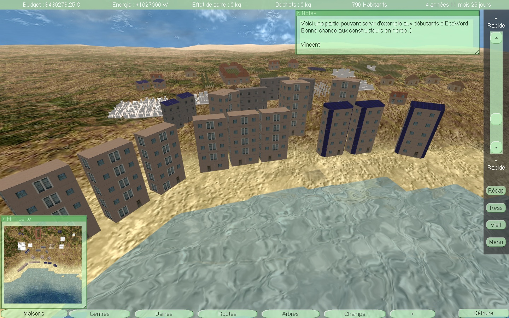

#EcoWorld

##Summary
EcoWorld is an ecological city-builder game.
It it written in C++ and uses a custom version of the 3D engine Irrlicht as well as many other libraries such as Spark (sparks engine), RakNet (network engine), irrKlang (sound engine)...

##Screenshot

